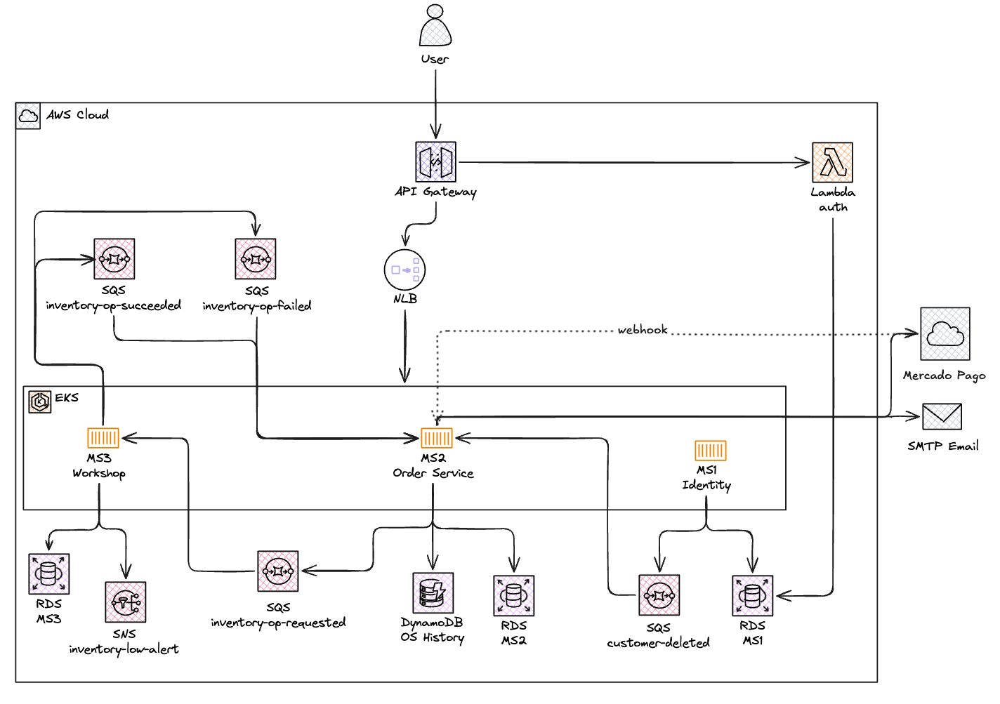
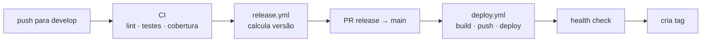
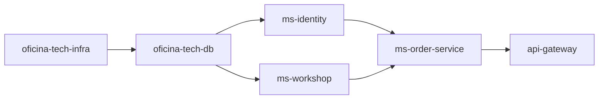

# Apresentação da Plataforma — Oficina Tech

## 1. Visão Geral da Arquitetura

## 2. Divisão dos Microsserviços

Os serviços foram desenhados a partir de **bounded contexts de negócio**, não de agrupamentos técnicos. Cada MS tem seu próprio banco — sem compartilhamento de schema.

| Microsserviço        | Bounded Context      | Responsabilidade central                                               |
| -------------------- | -------------------- | ---------------------------------------------------------------------- |
| **ms-identity**      | Identidade e acesso  | Autenticação, JWT, RBAC, CRUD de clientes e veículos                   |
| **ms-order-service** | Ciclo de vida das OS | Máquina de estados (12 status), saga orquestrado, Mercado Pago, e-mail |
| **ms-workshop**      | Catálogo e operações | Serviços, produtos, controle de inventário, participante do saga       |

A separação entre `ms-order-service` e `ms-workshop` é a mais importante: uma OS pode existir sem produto (apenas serviços de mão de obra), e o estoque pode ser gerenciado independentemente de qualquer OS em aberto.

**Ciclo de vida das OS:**

```mermaid
flowchart LR
    RECEIVED --> DIAGNOSING
    DIAGNOSING -- saga:\nRESERVE --> PENDING_AUTHORIZATION
    DIAGNOSING --> CANCELED
    PENDING_AUTHORIZATION -- aprovado --> AUTHORIZED
    PENDING_AUTHORIZATION -- negado --> AUTHORIZATION_DENIED
    AUTHORIZED --> IN_PROGRESS
    IN_PROGRESS -- saga:\nRESERVED_DECREASE --> COMPLETED
    COMPLETED -- cria Order\nMercado Pago --> AWAITING_PAYMENT
    AWAITING_PAYMENT -- webhook MP:\naprovado --> PAID
    AWAITING_PAYMENT -- webhook MP:\nrejeitado --> PAYMENT_REJECTED
    PAYMENT_REJECTED -- retry --> AWAITING_PAYMENT
    PAID --> DELIVERED
    PAID -- estorno MP\nRefundOrder --> CANCELED

    RECEIVED:::white
    DIAGNOSING:::white
    PENDING_AUTHORIZATION:::white
    AUTHORIZED:::white
    IN_PROGRESS:::white
    COMPLETED:::white
    AWAITING_PAYMENT:::mp
    PAID:::mp
    PAYMENT_REJECTED:::mp
    DELIVERED:::terminal
    CANCELED:::terminal
    AUTHORIZATION_DENIED:::terminal
    classDef white fill:#fff,stroke:#999,color:#000
    classDef terminal fill:#f5f5f5,stroke:#999,color:#000
    classDef mp fill:#009ee3,color:#fff,stroke:#007ab8
```

---

---

## 3. Saga Pattern — Por Que Escolhemos Orquestração

### O problema

Avançar uma Ordem de Serviço atravessa dois microsserviços com bancos independentes: `ms-order-service` (dono do estado da OS) e `ms-workshop` (dono do estoque). Não existe transação distribuída que abranja os dois — o Saga substitui o ACID com transações locais compensáveis.

### Por que Orquestração e não Coreografia

**1. A máquina de estados é complexa e pertence ao Order Service**
A OS tem 12 estados com transições condicionais (estoque, pagamento, aprovação manual). Com coreografia, o `ms-workshop` precisaria conhecer o estado da OS para decidir o que fazer — acoplamento de domínio inaceitável.

**2. Compensação tem múltiplos caminhos que dependem de contexto**
O mesmo cancelamento pode precisar de `CANCEL_RESERVED` (reserva ativa), `CANCEL_CONFIRMED` (OS concluída mas pagamento cancelado) ou nenhuma compensação (OS ainda em RECEIVED/DIAGNOSING). Esse contexto existe apenas no orquestrador.

**3. Rastreabilidade é crítica em fluxos transacionais**
Com orquestração, toda decisão está em um lugar. Os logs de saga (`saga_operations` no MS3, histórico no DynamoDB) formam uma linha do tempo auditável.

**4. O ms-workshop deve ser um participante burro**
Sua responsabilidade: executar operações de inventário de forma idempotente e reportar o resultado. Nunca decidir o que fazer com o pedido.

### Fluxo do Saga

**Caminho feliz:**

- `DIAGNOSING` → MS2 publica `RESERVE` → MS3 reserva estoque → sucesso: OS vai para `PENDING_AUTHORIZATION`; falha: permanece em `DIAGNOSING`
- `IN_PROGRESS` → MS2 publica `RESERVED_DECREASE` → MS3 deduz estoque → OS vai para `COMPLETED` → cria Order no MP → `AWAITING_PAYMENT`

**Compensação:**

- Cancelamento com reserva ativa → MS2 publica `CANCEL_RESERVED` → MS3 libera estoque → OS: `CANCELED`
- Cancelamento pós-conclusão → MS2 estorna no MP → publica `CANCEL_CONFIRMED` → MS3 devolve estoque → OS: `CANCELED`
- Deleção de cliente → MS1 publica `customer-deleted` → MS2 cancela todas as OS ativas

### Idempotência (garantia contra duplicatas SQS)

SQS opera em at-least-once delivery. O `ms-workshop` usa a tabela `saga_operations` com chave única `(saga_id, operation)`: se a mensagem chegar duplicada, republica o resultado armazenado sem reprocessar.

### Tabela de comandos

| Comando             | Disparado em                       | Efeito no estoque      |
| ------------------- | ---------------------------------- | ---------------------- |
| `RESERVE`           | DIAGNOSING → PENDING_AUTHORIZATION | `available → reserved` |
| `RESERVED_DECREASE` | IN_PROGRESS → COMPLETED            | `reserved → deduzido`  |
| `CANCEL_RESERVED`   | Cancelamento com reserva ativa     | `reserved → available` |
| `CANCEL_CONFIRMED`  | Cancelamento pós-conclusão         | devolve ao disponível  |

---

## 4. CI/CD — Fluxo Alto Nível

O padrão é o mesmo em todos os 6 repos: `develop → PR de release → main → deploy → tag`.
A tag só é criada após o health check confirmar que o deploy está saudável em produção.

### Fluxo comum

### O que muda por tipo de repo

| Repo                      | CI                                 | Deploy              | Health check           |
| ------------------------- | ---------------------------------- | ------------------- | ---------------------- |
| ms-identity · ms-workshop | lint · vet · testes · 80% coverage | Docker + Kubernetes | `/health` do pod       |
| ms-order-service          | + BDD Godog (saga)                 | Docker + Kubernetes | `/health` do pod       |
| oficina-tech-infra        | tf-validate · tf-plan · tfsec      | Terraform apply     | EKS nodes + NLB        |
| oficina-tech-db           | tf-validate · tf-plan · tfsec      | Terraform apply     | RDS status `available` |
| oficina-tech-api-gateway  | tf-validate · tf-plan · tfsec      | Terraform apply     | probe HTTP no API GW   |

### Ordem de deploy entre repos

---

## 5. Datadog — O Que Temos à Disposição

### Dashboards provisionados via Terraform (oficina-tech-infra)

#### Dashboard: "Oficina Tech - Overview"

| Seção                           | O que mostra                                                                                                                                                                                   |
| ------------------------------- | ---------------------------------------------------------------------------------------------------------------------------------------------------------------------------------------------- |
| **Latência das APIs**           | Percentis p50/p95/p99 ao longo do tempo · p95 por endpoint (tabela) · Throughput (req/s) por rota · Valor pontual do p95 atual (verde/amarelo/vermelho)                                        |
| **Consumo de Recursos K8s**     | CPU % do limite por deployment · Memória % do limite · Restarts de containers · Pods em execução (contagem atual)                                                                              |
| **Healthchecks e Uptime**       | Availability % (requisições 2xx) · Distribuição 2xx/4xx/5xx ao longo do tempo · Pods disponíveis ao longo do tempo                                                                             |
| **Erros e Falhas**              | Taxa de erros 5xx (%) ao longo do tempo · Error rate atual (valor pontual) · Erros de processamento de OS por tipo · Transições de status com falha · Tabela: 5xx por endpoint (top offenders) |
| **Volume de Ordens de Serviço** | Volume diário (barras) · Total criado no período · Funil de transições de status (sucesso por destino)                                                                                         |
| **Tempo por Status**            | Duração média por status ao longo do tempo · Tabela p50/p95 por status · Fluxo origem→destino de transições                                                                                    |

#### Dashboard: "Oficina Tech - Service Orders"

Foco exclusivo no ciclo de vida das OS: volume diário, tempo médio por status, percentis p50/p95 por status e funil de transições.

---

### Monitors (alertas → @slack-oncall)

**Infraestrutura e API:**

| Monitor                | Condição Warning    | Condição Critical    |
| ---------------------- | ------------------- | -------------------- |
| High API Latency (p95) | p95 > 1s em 5min    | p95 > 2s em 5min     |
| High 5xx Error Rate    | > 2% em 5min        | > 5% em 5min         |
| High Pod Restart Rate  | > 1 restart em 5min | > 2 restarts em 5min |
| High CPU Usage         | > 70% em 10min      | > 85% em 10min       |
| High Memory Usage      | > 70% em 10min      | > 85% em 10min       |

**Negócio — Ordens de Serviço:**

| Monitor              | Condição Warning              | Condição Critical                              |
| -------------------- | ----------------------------- | ---------------------------------------------- |
| SO Processing Errors | > 1 erro em 5min              | > 3 erros em 5min                              |
| SO Failure Rate      | > 20% falhas em 15min         | > 40% falhas em 15min                          |
| SO Stuck in Status   | p95 > 30min em status (1800s) | p95 > 60min em status (3600s)                  |
| SO Creation Drop     | —                             | 0 ordens criadas em 30min (also no-data alert) |

**CloudWatch (API Gateway):**

| Alarme     | Métrica                                   |
| ---------- | ----------------------------------------- |
| 5xx Errors | `5XXError` · AWS/ApiGateway · Sum/5min    |
| 4xx Errors | `4XXError` · AWS/ApiGateway · Sum/5min    |
| Latency    | `Latency` · AWS/ApiGateway · Average/5min |

---

### Métricas customizadas emitidas pelos MSs

| Métrica                           | Tag(s)                                               | Descrição                                         |
| --------------------------------- | ---------------------------------------------------- | ------------------------------------------------- |
| `service_order.created`           | `service:oficina-tech`                               | Contador de OS criadas                            |
| `service_order.status_transition` | `result:success/failure`, `from_status`, `to_status` | Transições de status                              |
| `service_order.status_duration`   | `status`                                             | Tempo (segundos) que uma OS ficou em cada status  |
| `service_order.processing_error`  | `error_type`                                         | Erros durante o processamento de avanço de status |
| `http.server.request.duration`    | `http.route`, `service:oficina-tech`                 | Latência das APIs (base para p50/p95/p99)         |
| `http.server.request.count`       | `status_code`, `http.route`                          | Volume de requisições por código de status        |
| `kubernetes.cpu.usage.total`      | `kube_deployment`                                    | CPU dos pods                                      |
| `kubernetes.memory.usage`         | `kube_deployment`                                    | Memória dos pods                                  |
| `kubernetes.pods.running`         | `kube_deployment`                                    | Pods ativos                                       |
| `kubernetes.containers.restarts`  | `kube_deployment`                                    | Restarts de containers                            |
