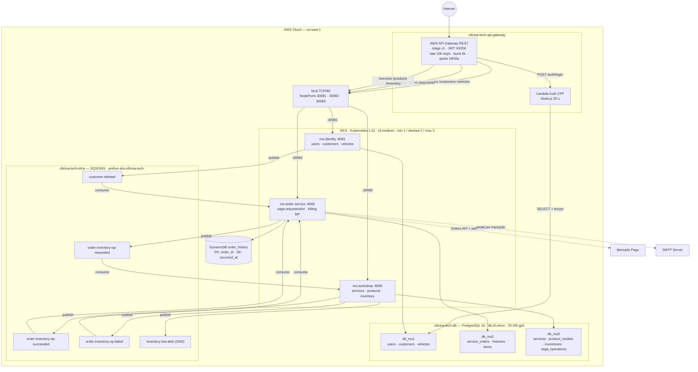
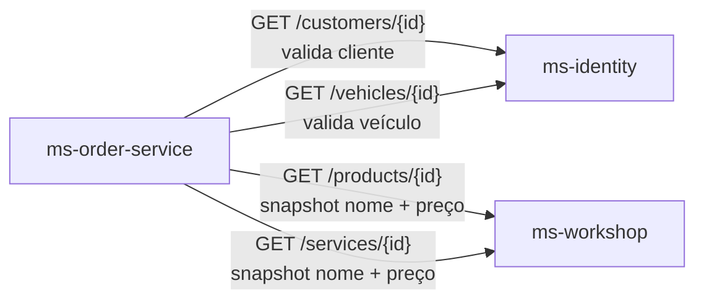
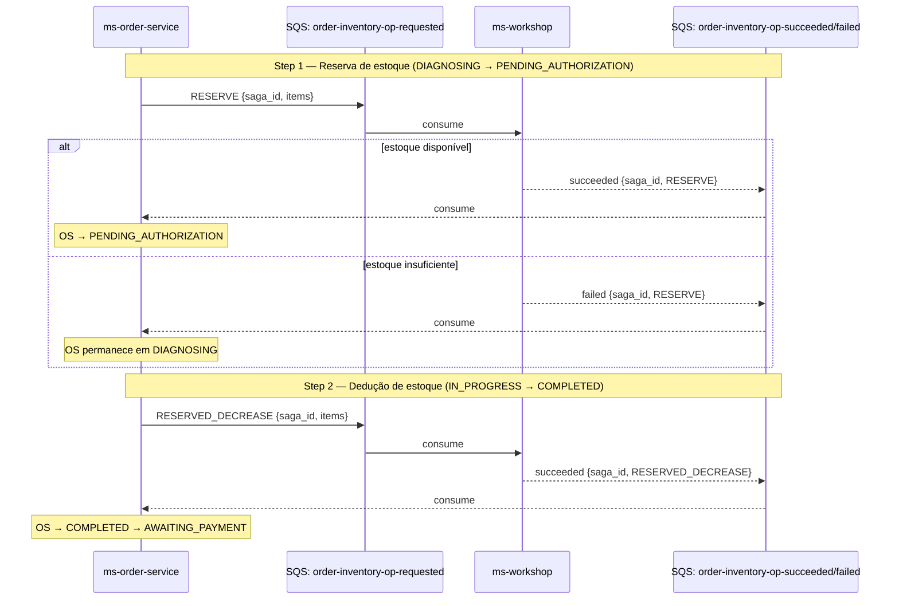
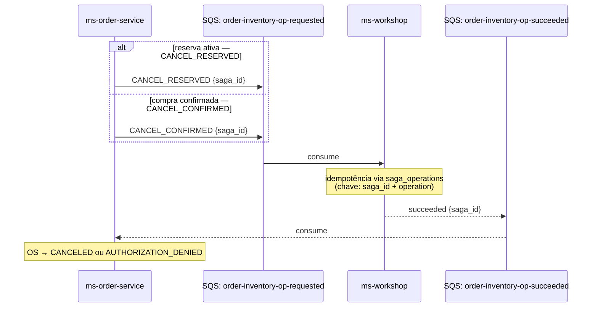
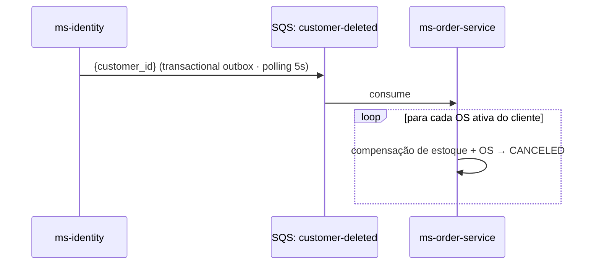
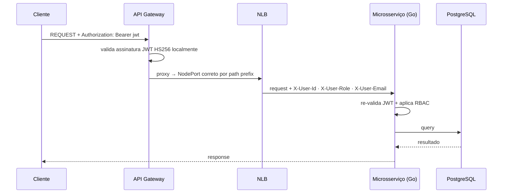
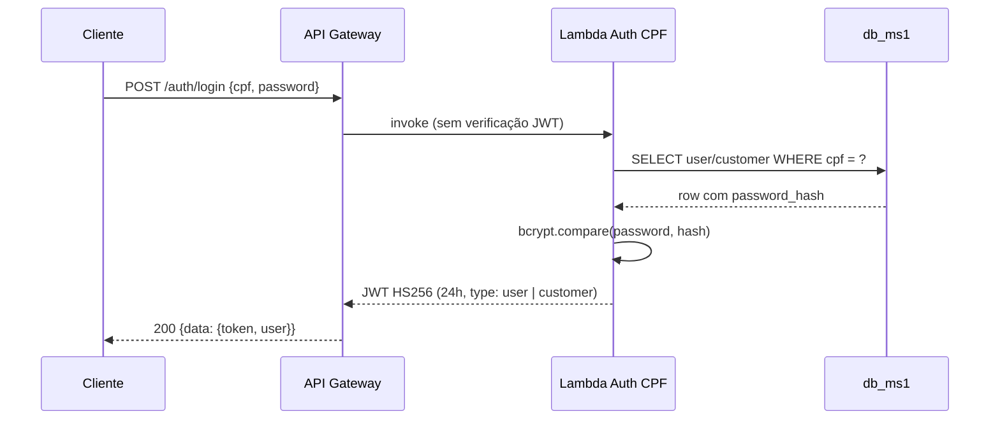
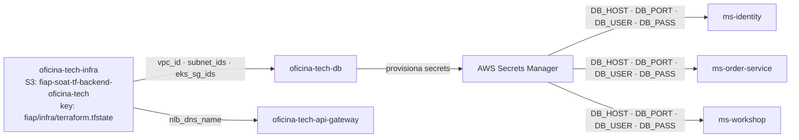
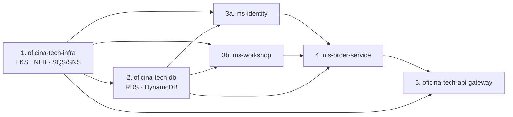

# Arquitetura Macro — Oficina Tech Platform

## Visão Geral

A plataforma Oficina Tech é composta por seis repos independentes hospedados na AWS. O backend é estruturado em três microsserviços independentes que se comunicam via REST síncrono (na criação de OS) e mensageria assíncrona AWS SQS/SNS (Saga Pattern e eventos de domínio).

---

## Diagrama de Alto Nível



---

## Comunicação entre Microsserviços

### REST Síncrono

Usado apenas na **criação de OS** para validar existência de cliente/veículo e capturar snapshots de preço/nome dos itens.



Após a criação da OS, o `ms-order-service` não consulta os outros serviços — os snapshots de nome e preço ficam armazenados em `service_order_items`.

### Mensageria Assíncrona — Saga Pattern (fluxo forward)

O `ms-order-service` é o **orquestrador** do Saga. A cada transição de status que envolve operação de estoque, publica um comando e aguarda o resultado:



### Mensageria Assíncrona — Compensação



### Evento Externo — customer-deleted



O `ms-workshop` garante idempotência via tabela `saga_operations` — operações duplicadas (at-least-once SQS) são detectadas pelo `saga_id + operation` e o resultado é republicado sem reprocessamento.

---

## Camadas da Arquitetura

### Camada de Entrada — `oficina-tech-api-gateway`

- Único ponto de entrada para requisições externas
- `POST /auth/login`: processado pela Lambda de auth (Node.js) que consulta `db_ms1` diretamente e emite JWT
- Demais rotas: HTTP proxy para o NLB com roteamento por path prefix para o microsserviço correto
- **Valida JWT localmente** (HS256, `JWT_SECRET_KEY`) — não delega ao `ms-identity` em tempo de execução
- Rate limiting (10.000 req/s, burst 5k), injeta headers `X-User-Id`, `X-User-Role`, `X-User-Email`

> Detalhes: [oficina-tech-api-gateway/docs/architecture.md](../oficina-tech-api-gateway/docs/architecture.md)

### Camada de Orquestração — `oficina-tech-infra`

- Cluster EKS (Kubernetes 1.31) com nodes `t3.medium` (min 1, desired 2, max 3)
- VPC padrão AWS (`172.31.0.0/16`) — descoberta via data source
- NLB público com 4 listeners TCP/80: roteia para NodePorts `30080` (gateway), `30081` (ms-identity), `30082` (ms-order), `30083` (ms-workshop)
- Filas SQS com prefixo `eks-oficina-tech-` e tópicos SNS para mensageria do saga e alertas
- State remoto em S3 (`fiap-soat-tf-backend-oficina-tech`, key `fiap/infra/terraform.tfstate`) — sem DynamoDB lock
- Expõe outputs via remote state S3 consumidos por `oficina-tech-db` e `oficina-tech-api-gateway`

> Detalhes: [oficina-tech-infra/docs/architecture.md](../oficina-tech-infra/docs/architecture.md)

### Camada de Negócio — Microsserviços

#### ms-identity — Identidade e Clientes

- Registro, login e emissão de JWT (HS256, 24h)
- CRUD de clientes (CPF/CNPJ) e veículos com validação de ownership
- Publica `customer-deleted` no SQS ao excluir cliente (transactional outbox, polling 5s)
- Expõe `GET /customers/{id}` e `GET /vehicles/{id}` para o ms-order-service
- Valida JWT localmente — não depende de nenhum outro serviço para auth

> Detalhes: [oficina-tech-ms-identity/README.md](../oficina-tech-ms-identity/README.md)

#### ms-order-service — Ordens de Serviço

- Ciclo de vida completo das OS com máquina de estados de 12 estados (RECEIVED → ... → DELIVERED, incluindo `PAYMENT_REJECTED`)
- **Orquestrador do Saga Pattern** — coordena operações de estoque com o ms-workshop via SQS
- Integração Mercado Pago (SDK Go, Orders API): cria Order → armazena `mp_order_id` → valida webhook HMAC-SHA256 → suporta retry, cancel e refund
- Histórico de status no DynamoDB (`order_history`, PK: `order_id`, SK: `occurred_at`)
- Notificações por email (SMTP) a cada transição de status — falha no envio não bloqueia a transição
- Consome `customer-deleted` (SQS) e cancela todas as OS ativas do cliente com compensação de estoque

> Detalhes: [oficina-tech-ms-order-service/README.md](../oficina-tech-ms-order-service/README.md)

#### ms-workshop — Workshop e Estoque

- Catálogo de serviços da oficina (nome, preço, duração estimada, categoria)
- Gestão de produtos com inventário em 3 quantidades: `available`, `reserved`, `pending`
- **Participante do Saga Pattern** — executa RESERVE, RESERVED_DECREASE, CANCEL_RESERVED, CANCEL_CONFIRMED sob comando do MS2 via SQS
- Idempotência via tabela `saga_operations` — chave `saga_id + operation`; resultado republicado sem reprocessamento em caso de duplicata
- Publica resultado ao MS2 via SQS e alertas de estoque baixo via SNS (`inventory-low-alert`) como side effect não bloqueante

> Detalhes: [oficina-tech-ms-workshop/README.md](../oficina-tech-ms-workshop/README.md)

### Camada de Dados — `oficina-tech-db`

- 3 instâncias RDS `db.t3.micro` PostgreSQL 16 em subnet privada: `db_ms1`, `db_ms2`, `db_ms3`
- 20 GB gp3 por instância, `multi_az=false`, backup com retenção de 1 dia
- Tabela DynamoDB `order_history` (PK: `order_id`, SK: `occurred_at`, billing: PAY_PER_REQUEST)
- Acessíveis apenas pelos pods do EKS (security group restrito ao SG do cluster EKS + CIDR da VPC)
- Credenciais provisionadas via AWS Secrets Manager por banco

> Detalhes: [oficina-tech-db/docs/architecture.md](../oficina-tech-db/docs/architecture.md)

---

## Fluxo de uma Requisição (rotas protegidas)



## Fluxo de Autenticação (`POST /auth/login`)



## Fluxo de Pagamento (`COMPLETED → PAID`)

Usa **Mercado Pago Orders API** via SDK Go (`github.com/mercadopago/sdk-go@v1.8.1`).

```mermaid
sequenceDiagram
    participant C as Cliente
    participant MS2 as ms-order-service
    participant SDK as SDK MP (Orders)
    participant MP as Mercado Pago

    C->>MS2: POST /service-orders/{id}/advance (OS em COMPLETED)
    MS2->>SDK: order.Create(items, payer com snapshot, urls)
    SDK->>MP: POST /v1/orders
    MP-->>SDK: {id: mp_order_id, transactions.payments[0].payment_method.redirect_url}
    SDK-->>MS2: Order Response
    MS2->>MS2: salva mp_order_id · OS → AWAITING_PAYMENT
    MS2-->>C: 202 {payment_url, mp_order_id}

    Note over C,MP: Cliente realiza pagamento no Mercado Pago

    MP->>MS2: POST /payments/mp-webhook {type:"order", data:{id: order_id}}
    MS2->>MS2: valida HMAC-SHA256 x-signature (manifest: id:{order_id};request-id:{req};ts:{ts};)
    MS2->>SDK: order.Get(order_id)
    SDK-->>MS2: order com transactions.payments[0].status
    alt approved
        MS2->>MS2: OS → PAID · persiste mp_payment_id · envia email
        MS2-->>MP: 200
    else rejected
        MS2->>MS2: OS → PAYMENT_REJECTED · persiste motivo · envia email com URL de retry
        MS2-->>MP: 200
    else pending / in_process
        MS2->>MS2: OS permanece em AWAITING_PAYMENT
        MS2-->>MP: 200
    end
```

---

## Segurança

| Camada | Mecanismo |
|--------|-----------|
| Gateway | Valida JWT (HS256) localmente — sem chamada ao ms-identity |
| Microsserviços | Re-validam JWT localmente com a mesma chave |
| Microsserviços | RBAC por rota (ADMIN, MECHANIC, CUSTOMER) |
| Rede | Security groups restritivos (portas 443, 30081–30083, 5432) |
| Broker | SQS/SNS em VPC privada |
| Secrets | AWS Secrets Manager (DB passwords, JWT_SECRET_KEY, MP tokens, SMTP) |
| Pagamento | Assinatura do webhook Mercado Pago validada (x-signature + MP_WEBHOOK_SECRET) |
| CI/CD | GitHub Actions com IAM roles |

**JWT_SECRET_KEY é o único secret compartilhado** entre todos os serviços — deve ser o mesmo valor configurado como secret em cada repo GitHub Actions. Nunca versionado em código.

---

## Remote State — Dependências entre Repos (Terraform)



Os microsserviços (`ms-identity`, `ms-order-service`, `ms-workshop`) leem suas connection strings e URLs do AWS Secrets Manager — não consomem remote state Terraform diretamente.

---

## Ordem de Deploy


