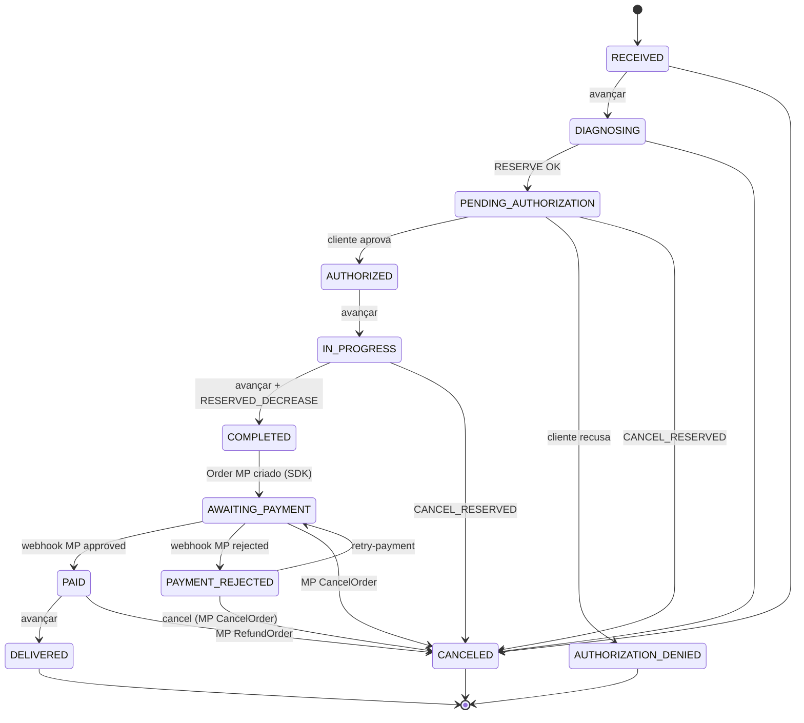

# Regras de Negócio Globais — Oficina Tech Platform

Regras que cruzam múltiplos repos ou que são referência para decisões em qualquer parte da plataforma.

---

## Autenticação e Identidade

- **Todos** os endpoints (exceto rotas públicas de login) exigem JWT válido no header `Authorization: Bearer <token>`
- JWT tem validade de **24 horas**, algoritmo HS256
- O secret JWT é compartilhado entre todos os componentes que emitem ou validam tokens via AWS Secrets Manager

### Pontos de emissão de JWT

| Quem emite | Endpoint | Para quem |
|-----------|----------|-----------|
| Lambda Auth CPF (`oficina-tech-api-gateway`) | `POST /auth/login` (externo, via API Gateway) | Usuários internos e clientes da oficina |

- Toda autenticação externa passa pela Lambda — os microsserviços não emitem tokens em resposta a chamadas externas
- O campo `type` no token distingue `"user"` (interno) de `"customer"` (cliente da oficina)
- CPF é usado como identificador único de login

## Controle de Acesso (RBAC)

Dois perfis internos com hierarquia: `ADMIN` > `MECHANIC`. Clientes da oficina usam identidade separada (`CUSTOMER`) e não fazem parte da hierarquia de usuários internos.

| Perfil | Quem é | Nível |
|--------|--------|-------|
| `ADMIN` | Administrador do sistema | 2 — acesso total |
| `MECHANIC` | Mecânico / atendente operacional | 1 — leitura geral e operações de OS |

### Permissões por recurso

| Recurso | MECHANIC | ADMIN |
|---------|----------|-------|
| Usuários — criar | — | Sim |
| Usuários — listar | — | Sim |
| Usuários — ver por ID | Próprio | Sim |
| Usuários — atualizar | Próprio | Sim |
| Usuários — excluir | — | Sim |
| Clientes — todas as operações | Sim | Sim |
| Veículos — todas as operações | Sim | Sim |
| Catálogo de serviços — leitura | Sim | Sim |
| Catálogo de serviços — escrita | — | Sim |
| Produtos (inventário) — todas as operações | Sim | Sim |
| Movimentações de estoque | — | Sim |
| Ordens de serviço — criar, ler, atualizar, avançar status | Sim | Sim |
| Ordens de serviço — excluir | — | Sim |

- Permissões são verificadas em cada microsserviço individualmente, não no gateway
- O gateway só verifica assinatura e expiração do JWT, injetando `X-User-Id`, `X-User-Role` e `X-User-Email` nos headers
- Autenticação de **clientes da oficina** é separada: feita via `POST /auth/login` com `type: "customer"` (usa o `Customer` como identidade, sem criar um `User`)

## Identificação de Entidades

- Todos os recursos usam **UUID v4** como identificador (`id`)
- **CPF** (pessoa física) e **CNPJ** (pessoa jurídica) são validados com algoritmo brasileiro (módulo 11)
- Um cliente pode ser PF ou PJ, nunca os dois
- Placa de veículo segue formato brasileiro (padrão Mercosul e antigo)

## Ordens de Serviço — Ciclo de Vida

- Status inicial: `RECEIVED`
- `DELIVERED`, `CANCELED` e `AUTHORIZATION_DENIED` são terminais — não permitem mais transições
- Ao mover para `PENDING_AUTHORIZATION`, o estoque de peças é reservado (não deduzido)
- Ao mover para `COMPLETED`, o estoque é efetivamente deduzido; a OS avança para `AWAITING_PAYMENT` via Orders API do Mercado Pago (SDK Go)
- `PAYMENT_REJECTED` não é terminal: permite retry (volta para `AWAITING_PAYMENT`) ou cancelamento explícito
- Se cancelada com reserva ativa, a reserva de estoque é liberada (compensação de saga)
- Cancelamento após pagamento (`PAID`) dispara estorno total no Mercado Pago antes de CANCELED; falha no estorno bloqueia a transição

## Notificações

- Email é enviado a cada transição de status da OS via SMTP
- Falha no envio de email **não** impede a transição de status (fire-and-forget)
- O ms-identity usa padrão transactional outbox com polling de 5 segundos para garantir entrega das mensagens SQS `customer-deleted`

## Estoque

- Produto com quantidade = 0 pode existir no catálogo mas não pode ser adicionado a uma OS
- Alerta de estoque baixo é gerado quando `quantidade_disponível ≤ quantidade_mínima`
- Quantidade mínima é configurável por produto (padrão: 5)

## Rate Limiting

- AWS API Gateway: `burst_limit=5000`, `rate_limit=10000 req/s`, `quota=1.000.000 req/dia`
- CloudWatch alarms: 5XX ≥ 10 erros, 4XX ≥ 100 erros, latência p99 ≥ 5000 ms

## Validações Globais

- Datas são sempre trafegadas em **ISO 8601** (UTC)
- Valores monetários são em **BRL (centavos)** internamente, formatados como float na API
- Paginação padrão: `page=1`, `limit=20`, máximo de `limit=100`
- Soft delete em todas as entidades principais (campo `deleted_at`)

## Ambientes

| Ambiente | Propósito |
|----------|-----------|
| `production` | Único ambiente provisionado (projeto acadêmico) |

> Todos os repos Terraform gerenciam apenas o ambiente `production`.
